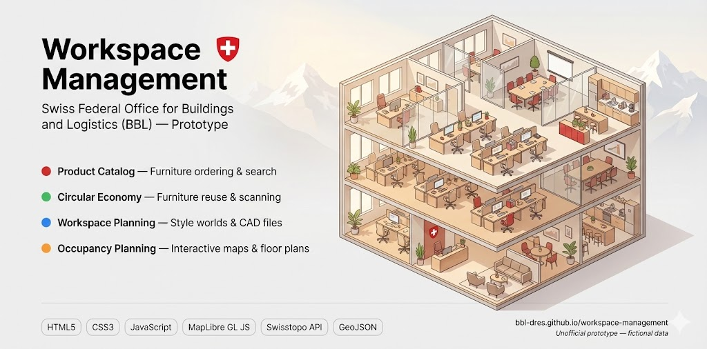
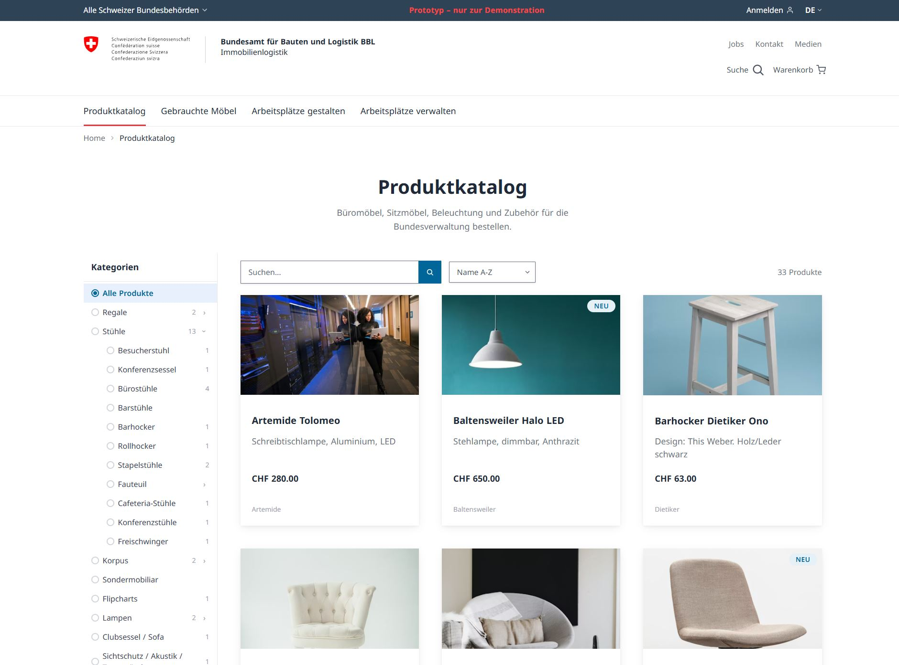
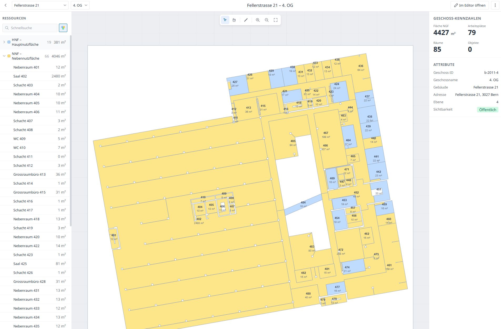

# Workspace Management



[](https://bbl-dres.github.io/workspace-management/)
[](LICENSE)

> [!CAUTION]
> This is an unofficial mockup for demonstration purposes only. All records are fictional, not every function is implemented, and it is not intended for production use.

A single-page BBL prototype for furniture ordering, workspace planning, circular reuse, and building occupancy.

## Demo

**Live demo:** https://bbl-dres.github.io/workspace-management/

**Floor-plan editor:** https://bbl-dres.github.io/workspace-management/floorplan-editor/index.html#/b-2011/b-2011-4

<p align="center">
  
  
</p>

## Features

- Browse and search a furniture catalogue, open product details, and manage a cart.
- Find reusable furniture, inspect items, scan identifiers, and register items for circulation.
- Explore workspace-planning guidance, Multispace modules, examples, and CAD downloads.
- Navigate occupancy from country and canton through buildings, floors, rooms, and assets.
- Search addresses and switch between interactive basemaps.
- Measure spaces, place furniture, explore 3D terrain, and prepare print views.
- Edit floor plans in the dedicated browser-based editor.

## Run locally

The app fetches static JSON and GeoJSON files, so serve the repository over HTTP:

```bash
python -m http.server 8000
```

Then open <http://localhost:8000/>.

## Documentation

- [Requirements](docs/REQUIREMENTS.md)
- [Design guide](docs/DESIGNGUIDE.md)
- [Data model](docs/DATAMODEL.md)

## License

Licensed under the [MIT License](LICENSE).
